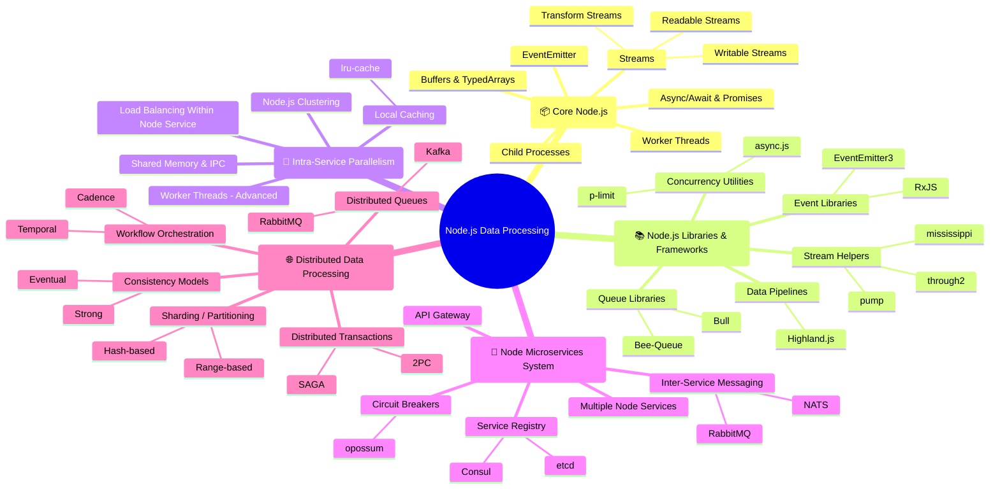

# Data processing overview – from core to cloud

```mermaid
  mindmap
    root((Node.js Data Processing))

      (📦 Core Node.js)
        Streams
          Readable Streams
          Writable Streams
          Transform Streams
        Buffers & TypedArrays
        EventEmitter
        Async/Await & Promises
        Child Processes
        Worker Threads

      (📚 Node.js Libraries & Frameworks)
        Stream Helpers
          through2
          pump
          mississippi
        Event Libraries
          RxJS
          EventEmitter3
        Concurrency Utilities
          async.js
          p-limit
        Data Pipelines
          Highland.js
        Queue Libraries
          Bull
          Bee-Queue

      (🧠 Intra-Service Parallelism)
        Node.js Clustering
        Worker Threads - Advanced
        Load Balancing Within Node Service
        Shared Memory & IPC
        Local Caching
          lru-cache

      (🧩 Node Microservices System)
        Multiple Node Services
        Inter-Service Messaging
          RabbitMQ
          NATS
        API Gateway
        Service Registry
          Consul
          etcd
        Circuit Breakers
          opossum

      (🌐 Distributed Data Processing)
        Distributed Queues
          Kafka
          RabbitMQ
        Distributed Transactions
          SAGA
          2PC
        Sharding / Partitioning
          Hash-based
          Range-based
        Consistency Models
          Eventual
          Strong
        Workflow Orchestration
          Temporal
          Cadence
```

```mermaid
  mindmap
    root((Node.js Data Processing))

      (📦 Core Node.js)
      :::highlight
        Streams
        :::highlight
          Readable Streams
          :::highlight
          Writable Streams
          :::highlight
          Transform Streams
          :::highlight
        Buffers & TypedArrays
        EventEmitter
        Async/Await & Promises
        Child Processes
        Worker Threads
        :::highlight

      (📚 Node.js Libraries & Frameworks)
        Stream Helpers
          through2
          pump
          mississippi
        Event Libraries
          RxJS
          EventEmitter3
        Concurrency Utilities
          async.js
          p-limit
        Data Pipelines
          Highland.js
        Queue Libraries
          Bull
          Bee-Queue

      (🧠 Intra-Service Parallelism)
        Node.js Clustering
        Worker Threads - Advanced
        Load Balancing Within Node Service
        Shared Memory & IPC
        Local Caching
          lru-cache

      (🧩 Node Microservices System)
        Multiple Node Services
        Inter-Service Messaging
          RabbitMQ
          NATS
        API Gateway
        Service Registry
          Consul
          etcd
        Circuit Breakers
          opossum

      (🌐 Distributed Data Processing)
        Distributed Queues
          Kafka
          RabbitMQ
        Distributed Transactions
          SAGA
          2PC
        Sharding / Partitioning
          Hash-based
          Range-based
        Consistency Models
          Eventual
          Strong
        Workflow Orchestration
          Temporal
          Cadence
```

