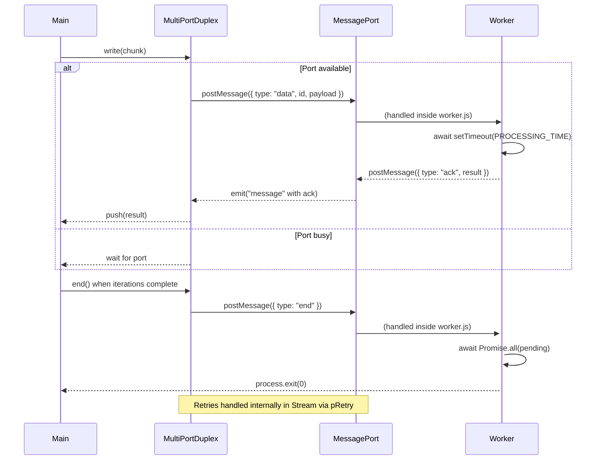

# Parallel processing live demo

  

    <h2>Covered aspects</h2> 
    <ul>
      <li>
        Back-pressure via busy flag
      </li>
      <li>
        Multiport duplex stream
      </li>
      <li>
        Joining workers to one output stream
      </li>
      <li>
        Assumed back pressure
      </li>
      <li>
        Handling sudden outage of some workers
      </li>
    </ul>
    <h2>Can be further explored</h2> 
    <ul>
      <li>
        Ordering
      </li>
      <li>
        Retry
      </li>
      <li>
        Cancellation
      </li>
    </ul>
  

  

    <h6>Cancellation</h6>
    <ul>
      <li>
        <strong>Voluntary Cancellation</strong> 
        Initiated willingly by one or more parties (a user cancels a subscription).
      </li>
      <li>
        <strong>Involuntary Cancellation</strong> 
        Imposed by external conditions (system shutdown, policy violation).
      </li>
      <li>
        <strong>Scheduled (Deferred) Cancellation</strong> 
        Set to happen at a future time (at the end of a billing cycle).
      </li>
      <li>
        <strong>Conditional Cancellation</strong> 
        Only occurs if specific conditions are met (no payment, no activity).
      </li>
      <li>
        <strong>Forceful (Hard) Cancellation</strong> 
        Irreversible and often abrupt (account termination).
      </li>
      <li>
        <strong>Graceful (Soft) Cancellation</strong> 
        Allows cleanup, notice period, or recovery options (cancellation with undo).
      </li>
    </ul>
  

  

    <h6>Cancellation: Fetch and Loops</h6>
    <ul>
      <li>
        <strong>1. Fetch / HTTP Requests</strong>
        <pre><code>await fetch(url, { signal });</code></pre>
        Prevents wasting network and memory when user or parent cancels.
      </li>
      <li>
        <strong>2. Long Async Loops</strong>
        <pre><code>async function process(signal) {
    while (!signal.aborted) {
      await step();
    }
  }
        </code></pre>
        Allows graceful shutdown of recurring async operations.
      </li>
    </ul>
  

  

    <h6>Cancellation: Timing and I/O</h6>
    <ul>
      <li>
        <strong>3. Delays and Timeouts</strong>
        <pre><code>await setTimeout(5000, undefined, { signal });</code></pre>
        Avoids unnecessary waiting when the task is no longer relevant.
      </li>
      <li>
        <strong>4. File System and I/O (Node.js ≥ v20)</strong>
        <pre><code>await fs.readFile("path", { signal });</code></pre>
        Aborts disk operations that might hang on network FS or large files.
      </li>
    </ul>
  

  

    <h6>Cancellation: External Services and Workers</h6>
    <ul>
      <li>
        <strong>5. External APIs / DB Queries</strong>
        <pre><code>await db.query(sql, { signal });</code></pre>
        Prevents locking DB resources when a user exits or task aborts.
      </li>
      <li>
        <strong>6. Worker Threads</strong>
        <pre><code>
  new Worker('./worker.js', {
    workerData: { signalState: controller.signal.aborted }
  });
        </code></pre>
        Ensures parallel work doesn't continue after main task is aborted.
      </li>
    </ul>
  

  

    <h6>Cancellation: Deep Calls and Polling</h6>
    <ul>
      <li>
        <strong>7. Deeply Nested Async Calls</strong>
        <pre><code>  async function outer(signal) {
    await inner(signal);
  }
  </code></pre>
        Signal must propagate through all levels for consistent behavior.
      </li>
      <li>
        <strong>8. Retry / Polling Loops</strong>
        <pre><code>  while (!signal.aborted) {
    await fetchResource();
    await setTimeout(1000, undefined, { signal });
  }
        </code></pre>
        Stops infinite retry attempts on cancellation.
      </li>
    </ul>
  

  

    <h6>Cancellation: Async Race and Heavy Work</h6>
    <ul>
      <li>
        <strong>9. Async Races</strong>
        <pre><code>  await Promise.race([
    existingPromise,
    signalToPromise(signal)
  ]);
        </code></pre>
        Ensures that cancellation wins if other promise hangs.
      </li>
      <li>
        <strong>10. CPU/Memory-Intensive Tasks</strong>
        <pre><code>await compressImage(buffer, { signal });</code></pre>
        Frees up system resources when task is no longer needed.
      </li>
    </ul>
  

  

    <h6>Cancellation: Streams and Parallel Tasks</h6>
    <ul>
      <li>
        <strong>11. Async Iterators / Streams</strong>
        <pre><code>  for await (const chunk of stream(signal)) {
    process(chunk);
  }
        </code></pre>
        Terminates stream reading or subscription safely.
      </li>
      <li>
        <strong>12. Parallel Async Tasks</strong>
        <pre><code>  await Promise.all([
    stepA(signal),
    stepB(signal),
  ]);
        </code></pre>
        All subtasks must honor the same cancellation to avoid leaks.
      </li>
    </ul>
  

  

    <h6>Cancellation: Third-Party and Best Practice</h6>
    <ul>
      <li>
        <strong>13. Third-Party Libraries</strong>
        <pre><code>await axios.get(url, { signal });</code></pre>
        Use signal wherever supported to abort HTTP/GPU/api tasks.
      </li>
      <li>
        <strong>14. Best Practice: Always Forward Signal</strong>
        <pre><code>
  function wrapper(signal) {
    return actual(signal);
  }
        </code></pre>
        Forward signal through all layers. It’s cheap and critical.
      </li>
    </ul>
  

  

    <h6>Flow diagram of /code/parallel</h6>
    

    

  

